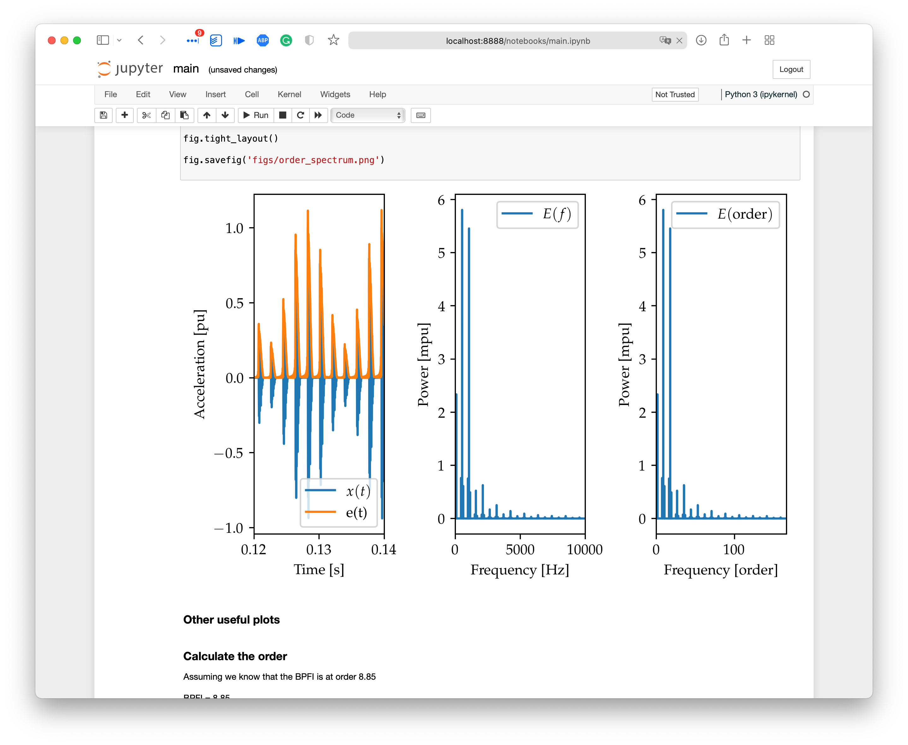

# Introduction to condition monitoring ofroller bearings

This repo contains an introductory presentation to the concepts of envelope and order spectrum.  This covers the basic principles and is not a complete overview.

**[Click here](latex/Main.pdf) to see the presentation.**

To run the notebook yourself, simply

```shell
cd python
pip install -r requirements.txt
jupyter notebook main.ipynb
```

The notebook should look something like


